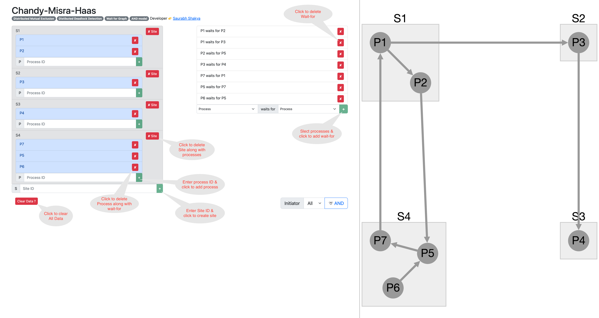
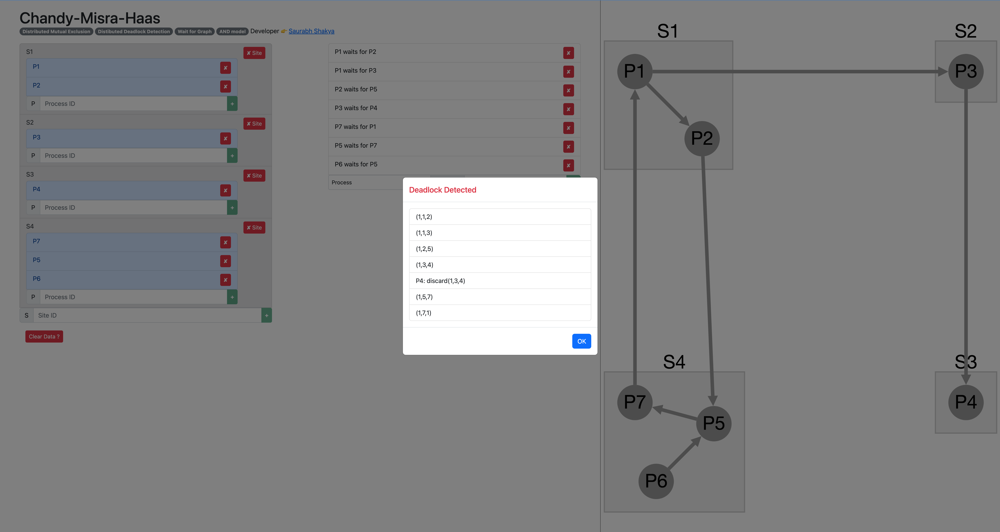

# Chandy-Misra-Haas
> AND model, Wait for Graph, Distributed Deadlock Detection, Distributed Mutual Exclusion

## Implementation
- Code ([Javascript](https://developer.mozilla.org/en-US/docs/Web/JavaScript))
- Intuitive UI ([AngularJS](https://angularjs.org/))
- Visualisation ([Cytoscape](https://cytoscape.org/))

## File Structure
+ demo <sub>directry for demo images/assets</sub>
+ dep <sub>directry to store 3rd party library for dependency</sub>
  - angular.min.js <sub>angularjs library for UI</sub>
  - bootstrap.bundle.min.js <sub>boostrstap library for styling</sub>
  - bootstrap.min.css <sub>boostrstap library for styling</sub>
  - cytoscape.min.js<sub>cytoscape library to draw diagram</sub>
+ script <sub>directrory for custom integration code</sub>
  - diagram.js <sub>code to integrate to cytoscape library</sub>
  - input.js <sub>code to integrate to angularjs library</sub>
  - sample.js <sub>code to generate sample input</sub>
+ style <sub>directory for custom styling</sub>
  - style.css <sub>custom stying for presentation on UI</sub>
- `cmh.js` <sub>actual implementation to detect distributed deadlock via CMH AND model</sub>
- `index.html` <sub>entrypoint to launch UI</sub>

## Infrastrcuture
- Operating System: Any
- Browser: <mark>Google Chrome</mark>, Apple Safari, Microsoft Edge (not ~~Internet Explorer~~) or Mozilla Firefox

## Steps to execute

```
Assumptions:
- All the process will have unique ID (positive number) accross all sites
- Sites will have unique ID (positive number). Sites used as input for visualization. 
  It is not used in deadlock detection algorithm.
- The input to the CMH algorithm is graph of process represented by adjacency list 
  (Map<Number,List<Number>>).
```

- Open [index.html](./index.html) in your favourite browser.
- Load sample data or create your own.
  - Load sample data can be done by clicking button `Sample Data ?` ([ref](./demo/1.png))
  - Clear all data using button `Clear Data?` (if required). ([ref](./demo/2.png))
  - Create your own data. ([ref](./demo/2.png))
    - Create Site: Enter unique numerical value, then `+` green button will be enabled to create site.
    - Add process to site: Enter unique(accross all sites) numerical value, then `+` green button will be enabled to add process to site.
    - Add wait-for: Choose source and target process such that source & target are different values and alredy not present in list; then `+` green button will be enabled to add wait-for.
    - Detele wait-for (if required) by `x` red button.
    - Delete process (if required) by `x` red button. Associated wait-for will be removed.
    - Delete site (if required) by `x site` red button. Associated process(es) and wait-for will be removed.
- Verify the data by visual diagram on right of the screen.
  - Move the components(site/process) by drag & drop if required.
  - Zoom in/out if required.
- Select initiatior process (default All). ([ref](./demo/3.png))
- Click button `AND` to execute the algorithm to detect distributed deadloack.
- View the result in popup header along with the list of probes send during the execution of algorithm. ([ref1](./demo/4.png), [ref2](./demo/5.png))

### Miscellaneous

Online Demo: [https://2022mt13139.github.io/dc-cmh](https://2022mt13139.github.io/dc-cmh)

Source Code: [https://github.com/2022mt13139/dc-cmh](https://github.com/2022mt13139/dc-cmh)

@Developer: [Saurabh Shakya](https://www.linkedin.com/in/saurabh-shakya/)



